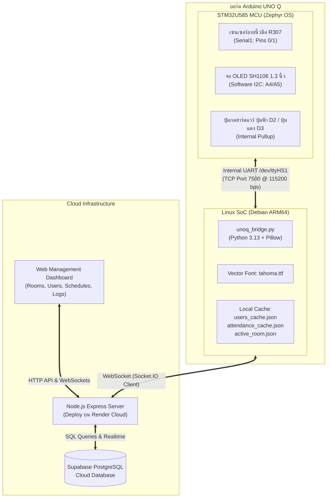

# 🌟 IoT Biometric Attendance System (Arduino UNO Q)
> **ระบบลงเวลาด้วยลายนิ้วมืออัจฉริยะ (IoT) พร้อมการเรนเดอร์ภาษาไทยระดับความละเอียดสูง ระบบยืนยันตัวตน 2 ขั้นตอน และการจัดการตารางเรียนแยกห้อง (Multi-Room Timetable)**

โปรเจกต์นี้เป็นการพัฒนาระบบลงเวลาด้วยลายนิ้วมือที่ใช้สถาปัตยกรรมประมวลผลร่วม **Heterogeneous Dual-Core (STM32 MCU + Linux SoC ARM64)** บนบอร์ด **Arduino UNO Q** ร่วมกับเซนเซอร์ลายนิ้วมือแบบ Optical (R307), หน้าจอแสดงผล OLED SH1106, ปุ่มกดฮาร์ดแวร์ยืนยันตัวตน (ปุ่มฟ้า D2 / ปุ่มแดง D3), และระบบจัดการผ่าน Cloud Web Application (Node.js + Express + Supabase PostgreSQL)

---

## 📑 สารบัญ
1. [จุดเด่นและฟังก์ชันหลัก (Key Features)](#-จุดเด่นและฟังก์ชันหลัก-key-features)
2. [สถาปัตยกรรมของระบบ (System Architecture)](#-สถาปัตยกรรมของระบบ-system-architecture)
3. [ตารางการเชื่อมต่อวงจร (Wiring & Pinout)](#-ตารางการเชื่อมต่อวงจร-wiring--pinout)
4. [โปรโตคอลและการสื่อสาร (Communication & Protocols)](#-โปรโตคอลและการสื่อสาร-communication--protocols)
5. [การจัดการข้อมูลและความปลอดภัย (Data Integrity & Biometrics)](#-การจัดการข้อมูลและความปลอดภัย-data-integrity--biometrics)
6. [การติดตั้งและใช้งาน (Installation & Setup)](#-การติดตั้งและใช้งาน-installation--setup)
7. [โครงสร้างไดเรกทอรี (Project Structure)](#-โครงสร้างไดเรกทอรี-project-structure)

---

## ✨ จุดเด่นและฟังก์ชันหลัก (Key Features)

* **🇹🇭 Offloaded TrueType Thai Typography:** แก้ปัญหาข้อจำกัดของไมโครคอนโทรลเลอร์ โดยให้ฝั่ง Linux SoC บนบอร์ดประมวลผลเรนเดอร์ภาษาไทยด้วยเวกเตอร์ฟอนต์ TrueType (`tahoma.ttf`) จัดระยะสระ-วรรณยุกต์ได้อย่างสมบูรณ์แบบ แล้วส่งเป็นภาพ Monochrome Bitmap (128x64) ไปเปิดบนจอ OLED
* **🏫 Multi-Room Timetable & Dynamic Room Synchronization:**
  * รองรับการจัดการตารางสอนแยกรายห้อง (เช่น ทค.1-101, ทค.2-101) พร้อมระบบนำเข้าไฟล์ Excel (.xlsx) และ Smart Room Detection อัตโนมัติ
  * ผู้ดูแลสามารถสลับห้องที่ใช้งานของเครื่อง Uno Q ได้แบบเรียลไทม์จาก Web Dashboard ผ่านอีเวนต์ `sync_device_room`
  * หน้าจอหลัก (Idle Screen) ของเครื่องจะแสดงแถบล่างระบุชื่อห้องปัจจุบัน เช่น `[ ทค.2-101 ] พร้อมใช้งาน` คมชัดตลอดเวลา
* **🔒 2-Step Physical Confirmation (Anti-Spoofing):** หลังแตะนิ้วผ่าน หน้าจอจะแสดงชื่อ-นามสกุลภาษาไทยเต็มบรรทัด (11pt Bold) พร้อมรอยืนยันจากปุ่มกดจริง:
  * **ปุ่มฟ้า D2 (Confirm):** กดยืนยันเพื่อบันทึกเวลาลงวิชาที่กำลังเรียนอยู่ในห้องนั้น
  * **ปุ่มแดง D3 (Rescan):** กดยกเลิกและสแกนใหม่ทันที (หากลายนิ้วมือไม่ตรงกับตัวจริง)
  * **Auto-Cancel (10 วินาที):** หากไม่มีการกดปุ่มใด ๆ ภายใน 10 วินาที ระบบจะยกเลิกอัตโนมัติ เพื่อป้องกันการสวมสิทธิ์
* **🛡️ Local Attendance Cache & Anti-Storm Engine:**
  * มีระบบแคชการลงเวลาประจำวันบนบอร์ด (`attendance_cache.json`) เมื่อกดยืนยันซ้ำ ระบบจะไม่ส่งเฟรมภาพซ้ำซ้อน ช่วยขจัดปัญหา UART Buffer Overflow
  * กลไก Frame Pacing หน่วงเวลาส่งเฟรมภาพอย่างน้อย 600ms และ Bitmap Hash Deduplication ป้องกันการชนกันของคำสั่งบนบัสสื่อสาร
* **🔄 Zero-Hang State Recovery:**
  * **Initial Boot Watchdog (3.5s):** ป้องกันปัญหาหน้าจอค้างที่ "READY FOR SCAN" เมื่อเปิดเครื่องครั้งแรก ด้วยการตรวจจับ `EVENT:IDLE` จาก MCU และรีเฟรชหน้าจอ Idle พร้อมชื่อห้องโดยอัตโนมัติ
  * **Access Denied Auto-Recovery:** เมื่อสแกนลายนิ้วมือที่ไม่ตรงกับฐานข้อมูล (`EVENT:NO_MATCH`) หน้าจอจะแสดงข้อความแจ้งเตือนภาษาไทยเป็นเวลา 3 วินาที แล้วสลับกลับสู่หน้าจอ Idle พร้อมใช้งานทันที
* **🖐️ 3-Finger Biometric Redundancy:** ผู้ใช้ 1 คนสามารถลงทะเบียนลายนิ้วมือได้ 3 นิ้ว (เช่น นิ้วโป้ง, นิ้วชี้, นิ้วกลาง) เพื่อป้องกันปัญหานิ้วเปียกหรือถลอก รองรับผู้ใช้ได้สูงสุด 100 คน (300 Slots)
* **🚫 Hardware Duplicate Fingerprint Check:** ตรวจสอบลายนิ้วมือซ้ำตั้งแต่ขั้นตอนแรกของการลงทะเบียน หากนิ้วนั้นมีในระบบอยู่แล้ว เซนเซอร์จะปฏิเสธทันที และหน้าเว็บจะแจ้งเตือนพร้อมแสดงชื่อผู้ครอบครองลายนิ้วมือนั้น
* **🧹 Full Auto-Rollback:** หากการลงทะเบียนลายนิ้วมือไม่ครบทั้ง 3 นิ้ว หรือผู้ใช้กดยกเลิกกลางคัน ระบบจะล้าง Slot ในเซนเซอร์ R307 และสั่งลบแถวข้อมูลใน Cloud Database ทันที 100% ป้องกันการเกิดข้อมูลขยะ (Orphan Records)
* **⚡ Offline-First Architecture:** ฝั่งบอร์ดมีหน่วยความจำแคชรายชื่อ (`users_cache.json`) และห้องประจำการ ทำให้สามารถสแกน ระบุชื่อ และเรนเดอร์ผลลัพธ์ขึ้นจอได้ภายในเวลา < 1ms แม้ไม่มีสัญญาณอินเทอร์เน็ต

---

## 🏛️ สถาปัตยกรรมของระบบ (System Architecture)



---

## 🔌 ตารางการเชื่อมต่อวงจร (Wiring & Pinout)

### 1. เซนเซอร์ลายนิ้วมือ R307 (UART Serial1)
| สาย R307 | สีสายมาตรฐาน | ขาบน Arduino UNO Q | คำอธิบาย |
| :--- | :--- | :--- | :--- |
| **VCC** | สีแดง | **5V** | ไฟเลี้ยงเซนเซอร์ 5V DC |
| **GND** | สีดำ | **GND** | กราวด์ร่วมของระบบ |
| **TXD** | สีเหลือง | **Pin 0 (RX)** | ขาส่งข้อมูลของ R307 เข้าขาบอร์ด |
| **RXD** | สีเขียว | **Pin 1 (TX)** | ขารับคำสั่งจากบอร์ดไป R307 |

### 2. หน้าจอแสดงผล SH1106 OLED 1.3 นิ้ว (I2C)
| ขา OLED | ขาบน Arduino UNO Q | คำอธิบาย |
| :--- | :--- | :--- |
| **VCC** | **3.3V / 5V** | ไฟเลี้ยงหน้าจอ |
| **GND** | **GND** | กราวด์ |
| **SDA** | **Pin A4** | ขาสัญญาณ Data (Software I2C) |
| **SCL** | **Pin A5** | ขาสัญญาณ Clock (Software I2C) |

### 3. ปุ่มกดยืนยันการลงเวลา (Push Buttons - Active LOW)
| ปุ่มกด | ฟังก์ชัน | ขาบน Arduino UNO Q | โหมดขาพิน (Firmware) | การแสดงผลบนจอ |
| :--- | :--- | :--- | :--- | :--- |
| **Button 1 (สีฟ้า)** | **Confirm (ยืนยัน)** | **Pin D2** ต่อลง **GND** | `INPUT_PULLUP` (กด = LOW) | `ปุ่มฟ้า:ยืนยัน` |
| **Button 2 (สีแดง)** | **Rescan (สแกนใหม่/ยกเลิก)** | **Pin D3** ต่อลง **GND** | `INPUT_PULLUP` (กด = LOW) | `ปุ่มแดง:สแกน` |

---

## 📡 โปรโตคอลและการสื่อสาร (Communication & Protocols)

### 1. 16-Byte Chunking Protocol (ป้องกัน UART Buffer Overrun)
* **ปัญหาทางวิศวกรรม:** บัฟเฟอร์ UART RX FIFO ของ Zephyr OS บน STM32 มีขนาดจำกัดเพียง **64 ไบต์** การส่งข้อมูลภาพ 1,024 ไบต์รวดเดียวจะทำให้ข้อมูลล้นบัฟเฟอร์ ภาพบนหน้าจอขาดแหว่ง
* **แนวทางแก้ไข:**
  * ฝั่ง Linux แบ่งภาพขนาด 1,024 ไบต์ ออกเป็น **64 ชิ้นย่อย (ชิ้นละ 16 ไบต์ = Hex String 32 ตัวอักษร)**
  * มีความยาวแต่ละบรรทัดเพียง **46 ตัวอักษร** (ไม่เกิน 64 ไบต์)
  * กำหนด **Pacing Delay 6ms** ระหว่างชิ้น
  * ทำงานในโหมด **Quiet UART** (STM32 จะไม่ส่งข้อมูลสวนกลับมาจนกว่าจะจบเฟรม)
  * กำหนดระยะห่างระหว่างการสลับหน้าจอ (Frame Gap) อย่างน้อย **600ms** และข้ามการส่งภาพเดิมซ้ำ (Deduplication)

### 2. รหัสคำสั่งสำคัญระหว่าง Linux และ MCU (Serial Command Set)
| คำสั่ง / รูปแบบ | ทิศทาง | หน้าที่ |
| :--- | :--- | :--- |
| `ENROLL <slot>` | Server $\rightarrow$ MCU | สั่งเซนเซอร์เข้าสู่โหมดบันทึกลายนิ้วมือใน Slot ที่ระบุ |
| `CANCEL_ENROLL` | Server $\rightarrow$ MCU | ยกเลิกขั้นตอนลงทะเบียนทันที |
| `DELETE <slot>` | Server $\rightarrow$ MCU | ลบลายนิ้วมือออกจากเซนเซอร์ R307 |
| `BACKUP <slot>` | Server $\rightarrow$ MCU | ดึงข้อมูล Template (512 ไบต์) ออกมาสำรองลง Cloud |
| `RESTORE <slot> <data>` | Server $\rightarrow$ MCU | กู้คืน Template จาก Cloud เขียนกลับลงหน่วยความจำเซนเซอร์ |
| `STATUS:R307_READY` | MCU $\rightarrow$ Server | เซนเซอร์ R307 เชื่อมต่อสำเร็จและพร้อมทำงาน |
| `EVENT:IDLE` | MCU $\rightarrow$ Server | แจ้งว่า MCU อยู่ในสถานะสแตนด์บาย รอนิ้วสแกน |
| `EVENT:NO_MATCH` | MCU $\rightarrow$ Server | ตรวจพบลายนิ้วมือที่ไม่ตรงกับฐานข้อมูลในเซนเซอร์ |
| `EVENT:CONFIRMED ID=<slot> SCORE=<val>` | MCU $\rightarrow$ Server | ผู้ใช้กดปุ่มฟ้า D2 ยืนยัน $\rightarrow$ บันทึกเวลาลงฐานข้อมูล |
| `EVENT:CANCELLED` | MCU $\rightarrow$ Server | ผู้ใช้กดปุ่มแดง D3 สแกนใหม่ $\rightarrow$ ละเว้นการบันทึก |
| `RESP:ENROLL_FAIL_DUPLICATE ID=<slot>` | MCU $\rightarrow$ Server | ตรวจพบลายนิ้วมือซ้ำกับ Slot ที่มีอยู่แล้ว |

---

## 🔒 การจัดการข้อมูลและความปลอดภัย (Data Integrity & Biometrics)

1. **การจับคู่ Slot ID กับ User ID (Biometric Slot Mapping):**
   * ระบบ 3 นิ้วต่อคน ใช้สมการคำนวณเชิงเส้น:
     $$\text{Slot 1} = (\text{User ID} - 1) \times 3 + 1$$
     $$\text{Slot 2} = (\text{User ID} - 1) \times 3 + 2$$
     $$\text{Slot 3} = (\text{User ID} - 1) \times 3 + 3$$
   * เมื่อแตะนิ้วใดนิ้วหนึ่ง เซิร์ฟเวอร์จะทำ Reverse Mapping กลับไปยัง User ID:
     $$\text{User ID} = \left\lfloor\frac{\text{Slot ID} - 1}{3}\right\rfloor + 1$$
2. **การจัดเก็บ Template ใน Database:**
   * ข้อมูล Template ทั้ง 3 นิ้วจะถูกแปลงเป็นรหัส Hex และบันทึกรวมกันในคอลัมน์ `fingerprint_template` คั่นด้วยจุลภาค (`,`)
   * ผู้ใช้ที่มีข้อมูลลายนิ้วมืออยู่ในเซนเซอร์จะมีแฟล็ก `in_sensor = 1` (แสดงป้ายสีเขียว **Tier 1** บนหน้าเว็บ)
3. **ระบบ Auto-Rollback ป้องกันข้อมูลค้าง:**
   * หากขั้นตอนการลงทะเบียนลายนิ้วมือล้มเหลว หรือถูกกดยกเลิกกลางคัน ฟังก์ชัน `cleanupFailedEnroll()` จะทำงานอัตโนมัติ:
     1. สั่งลบ Slot 1, 2, 3 ในเซนเซอร์ R307
     2. รันคำสั่ง `DELETE FROM users WHERE id = ?` ใน Supabase
     3. ส่งสัญญาณ Socket.IO ให้หน้าเว็บรีเฟรชตารางรายชื่อทันที
4. **ระบบ Multi-Room Schedule & Attendance Verification:**
   * บันทึกการลงเวลาจะตรวจสอบคาบเรียนของห้องที่อุปกรณ์ประจำการอยู่แบบอัตโนมัติ คำนวณสถานะ เข้าเรียน (On-time), มาสาย (Late), หรือขาดเรียน (Absent) ตามเวลาที่กำหนดในตารางเรียน

---

## 🚀 การติดตั้งและใช้งาน (Installation & Setup)

### 1. คอมไพล์และแฟลชเฟิร์มแวร์ STM32
```powershell
# ติดตั้งบอร์ด Arduino UNO Q ผ่าน arduino-cli
arduino-cli compile --fqbn arduino:zephyr:unoq sketch/sketch.ino
arduino-cli upload -p COM12 --fqbn arduino:zephyr:unoq sketch/sketch.ino
```

### 2. ติดตั้งและเริ่มทำงานฝั่ง Linux SoC บน Uno Q
```bash
# เชื่อมต่อผ่าน ADB ไปยังบอร์ด Uno Q
adb shell

# รัน Bridge Service เบื้องหลัง
python3 -u /home/arduino/unoq_bridge.py > /home/arduino/bridge.log 2>&1 &
```

### 3. รันเซิร์ฟเวอร์ Node.js (เครื่องแม่ข่าย / Local Test)
```powershell
cd server
npm install
npm start
```
เปิดบราวเซอร์ไปที่: `http://localhost:3000` (หรือเชื่อมต่อไปยัง Render Cloud URL ของระบบ)

---

## 📁 โครงสร้างไดเรกทอรี (Project Structure)

```text
Fingerprint/
├── sketch/
│   └── sketch.ino             # เฟิร์มแวร์ C++ สำหรับ STM32 (R307, OLED, D2/D3, Serial Protocol)
├── unoq_bridge.py             # Graphic & Offline Cache Engine สำหรับ Uno Q Linux SoC
├── server/
│   ├── server.js              # Express API Server, Socket.IO Real-time Controller
│   ├── database.js            # เชื่อมต่อ Supabase PostgreSQL Cloud Database
│   ├── public/
│   │   ├── index.html         # หน้า Dashboard แสดงสถานะและบันทึกเวลาสแกนนิ้วเรียลไทม์
│   │   ├── users.html         # หน้าระบบจัดการผู้ใช้งาน และลงทะเบียนลายนิ้วมือ 3 นิ้ว
│   │   ├── schedules.html     # หน้าระบบจัดการตารางเรียนแยกห้อง (Multi-Room Timetable)
│   │   ├── login.html         # หน้าระบบล็อกอินสำหรับผู้ดูแลระบบ (Admin)
│   │   ├── js/
│   │   │   ├── app.js         # สคริปต์ Frontend Web Interface
│   │   │   └── schedules.js   # สคริปต์จัดการตารางสอนและนำเข้าไฟล์ Excel
│   │   └── css/               # ไฟล์สไตล์ Tailwind CSS
├── DECISIONS.md               # บันทึกการตัดสินใจทางสถาปัตยกรรม (Architecture Decision Records)
├── SCRATCHPAD.md              # บันทึกสถานะการพัฒนาปัจจุบัน (Development Context)
└── README.md                  # เอกสารคู่มือโครงการฉบับสมบูรณ์
```

---

## 👥 ผู้พัฒนาโครงงาน (Developers)
* โครงงานระบบลงเวลาด้วยลายนิ้วมืออัจฉริยะ (IoT Biometric Attendance System)
* พัฒนาและทดสอบบนฮาร์ดแวร์จริง **Arduino UNO Q (STM32 + Linux SoC)** ร่วมกับ **R307 Optical Sensor** และ **Supabase Cloud Database**
