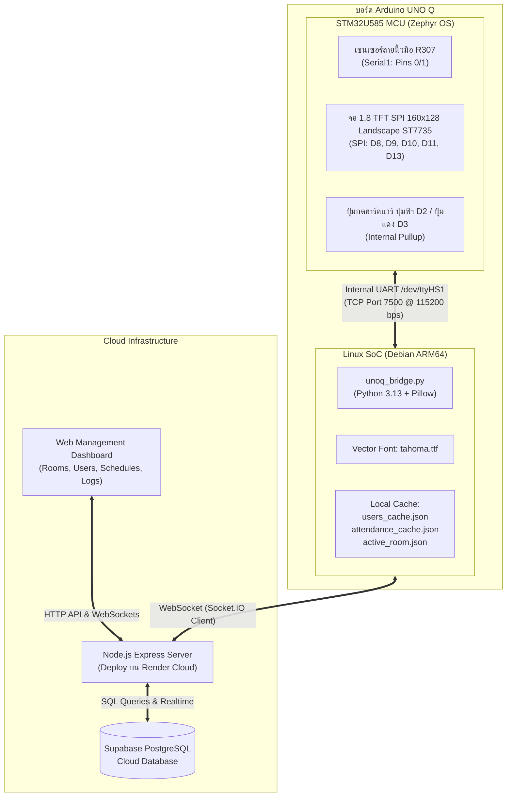

# 🌟 IoT Biometric Attendance System (Arduino UNO Q)
> **ระบบลงเวลาด้วยลายนิ้วมืออัจฉริยะ (IoT) พร้อมการเรนเดอร์ภาษาไทยระดับความละเอียดสูง ระบบยืนยันตัวตน 2 ขั้นตอน และการจัดการตารางเรียนแยกห้อง (Multi-Room Timetable)**

โปรเจกต์นี้เป็นการพัฒนาระบบลงเวลาด้วยลายนิ้วมือที่ใช้สถาปัตยกรรมประมวลผลร่วม **Heterogeneous Dual-Core (STM32 MCU + Linux SoC ARM64)** บนบอร์ด **Arduino UNO Q** ร่วมกับเซนเซอร์ลายนิ้วมือแบบ Optical (R307), หน้าจอแสดงผล 1.8" TFT SPI 160x128 แนวนอน (ST7735 v1.1 Landscape Mode), ปุ่มกดฮาร์ดแวร์ยืนยันตัวตน (ปุ่มฟ้า D2 / ปุ่มแดง D3), และระบบจัดการผ่าน Cloud Web Application (Node.js + Express + Supabase PostgreSQL)

---

## 📑 สารบัญ
1. [จุดเด่นและฟังก์ชันหลัก (Key Features)](#-จุดเด่นและฟังก์ชันหลัก-key-features)
2. [สถาปัตยกรรมของระบบ (System Architecture)](#-สถาปัตยกรรมของระบบ-system-architecture)
3. [ตารางการเชื่อมต่อวงจร (Wiring & Pinout)](#-ตารางการเชื่อมต่อวงจร-wiring--pinout)
4. [โปรโตคอลและการสื่อสาร (Communication & Protocols)](#-โปรโตคอลและการสื่อสาร-communication--protocols)
5. [การจัดการข้อมูลและความปลอดภัย (Data Integrity & Biometrics)](#-การจัดการข้อมูลและความปลอดภัย-data-integrity--biometrics)
6. [การติดตั้งและใช้งาน (Installation & Setup)](#-การติดตั้งและใช้งาน-installation--setup)
7. [โครงสร้างไดเรกทอรี (Project Structure)](#-โครงสร้างไดเรกทอรี-project-structure)

---

## ✨ จุดเด่นและฟังก์ชันหลัก (Key Features)

* **🖼️ Offloaded TrueType Thai Rendering & Bridge Graphic Pipeline (การส่งภาพผ่าน Bridge):**
  * **แก้ปัญหาข้อจำกัดของไมโครคอนโทรลเลอร์ (ADR-001, ADR-002):** การให้ชิป STM32 เรนเดอร์ฟอนต์ไทยเองจะทำให้สระ-วรรณยุกต์ซ้อนทับกันเละและกิน Flash/RAM จนหมด และการให้ Cloud เรนเดอร์จะเกิด Network Latency 1-2 วินาทีและพังเมื่อเน็ตหลุด ระบบจึงใช้สถาปัตยกรรม **Host-Side Offloading** ให้ Linux SoC ARM64 บนบอร์ด Uno Q เรนเดอร์ข้อความภาษาไทยด้วย Python Pillow (`unoq_views.py`) และเวกเตอร์ฟอนต์ TrueType (`tahoma.ttf`) จัดตำแหน่งสระ-วรรณยุกต์สมบูรณ์ 100%
  * **1-Bit Raster Bitmap Compression (2,560 ไบต์):** หน้าจอความละเอียด 160x128 แนวนอน ($20,480$ พิกเซล) ถูกบีบอัดเป็น 1-bit Monochrome Bitmap ($20,480 \div 8 = 2,560$ ไบต์) พร้อมส่ง Theme Header (เช่น `FRAME_START THEME=CARD`) ให้ MCU แมปสี 16-bit RGB565 แบบ Zone-based Multi-color (หัวข้อสีทอง RMUTL / เขียว / แดง, ตัวอักษรสีขาว / อำพัน, ปุ่มกดฟ้า D2 / แดง D3)
  * **16-Byte Chunking Protocol ป้องกัน UART Overflow:** เนื่องจากบัฟเฟอร์ Zephyr OS UART RX FIFO บน STM32 มีขนาดเพียง **64 ไบต์** สคริปต์บริดจ์ (`unoq_bridge.py`) จึงหั่นบิตแมป 2,560 ไบต์ออกเป็น **160 ชิ้นย่อย (ชิ้นละ 16 ไบต์ = Hex String 32 ตัวอักษร)** ส่งคำสั่ง `FRAME_DATA <offset> <hex>\n` ยาวเพียง ~48 ตัวอักษร ปลอดภัยต่อบัฟเฟอร์ 64 ไบต์ 100%
  * **Pacing Delay & Quiet UART Mode:** หน่วงเวลาส่ง 5-6ms ต่อชิ้น และให้ STM32 เข้าสู่โหมดเงียบเสียง (ห้ามส่งข้อมูลสวนกลับมาจนกว่าจะได้รับ `FRAME_END`) ส่งภาพทั้งจอเสร็จสมบูรณ์ในเวลาเพียง **~0.38 วินาที**
  * **Deduplication & Inter-frame Gap:** มีระบบ Bitmap Hash Deduplication ป้องกันการส่งภาพเดิมซ้ำซ้อน และหน่วงเวลาระหว่างเฟรมอย่างน้อย 600ms เพื่อให้ไมโครคอนโทรลเลอร์ขับหน้าจอ TFT ST7735 จนเสร็จสิ้น ขจัดปัญหาจอค้าง จอแตก หรือภาพขาดแหว่ง
* **🏫 Multi-Room Timetable & Dynamic Room Synchronization:**
  * รองรับการจัดการตารางสอนแยกรายห้อง (เช่น ทค.1-101, ทค.2-101) พร้อมระบบนำเข้าไฟล์ Excel (.xlsx) และ Smart Room Detection อัตโนมัติ
  * ผู้ดูแลสามารถสลับห้องที่ใช้งานของเครื่อง Uno Q ได้แบบเรียลไทม์จาก Web Dashboard ผ่านอีเวนต์ `sync_device_room`
  * หน้าจอหลัก (Idle Screen) ของเครื่องจะแสดงแถบล่างระบุชื่อห้องปัจจุบัน เช่น `[ ทค.2-101 ] พร้อมใช้งาน` คมชัดตลอดเวลา
* **🔒 2-Step Physical Confirmation (Anti-Spoofing & Resilience - ADR-028):** หลังแตะนิ้วผ่าน หน้าจอจะแสดงชื่อ-นามสกุลภาษาไทยเต็มบรรทัด (11pt Bold) พร้อมรอยืนยันจากปุ่มกดจริง:
  * **ปุ่มฟ้า D2 (Confirm):** กดยืนยันเพื่อบันทึกเวลาลงวิชาที่กำลังเรียนอยู่ในห้องนั้น พร้อม Selective Command Filter ป้องกันไม่ให้ Background Watchdog ขัดจังหวะการกดปุ่ม
  * **ปุ่มแดง D3 (Rescan):** กดยกเลิกและสแกนใหม่ทันที (หากลายนิ้วมือไม่ตรงกับตัวจริง)
  * **Auto-Cancel (10 วินาที):** หากไม่มีการกดปุ่มใด ๆ ภายใน 10 วินาที ระบบจะยกเลิกอัตโนมัติ เพื่อป้องกันการสวมสิทธิ์
* **🛡️ Local Attendance Cache & Anti-Storm Engine:**
  * มีระบบแคชการลงเวลาประจำวันบนบอร์ด (`attendance_cache.json`) เมื่อกดยืนยันซ้ำ ระบบจะไม่ส่งเฟรมภาพซ้ำซ้อน ช่วยขจัดปัญหา UART Buffer Overflow
  * กลไก Frame Pacing หน่วงเวลาส่งเฟรมภาพอย่างน้อย 600ms และ Bitmap Hash Deduplication ป้องกันการชนกันของคำสั่งบนบัสสื่อสาร
* **🔄 Zero-Hang State Recovery:**
  * **Initial Boot Watchdog (3.5s):** ป้องกันปัญหาหน้าจอค้างที่ "READY FOR SCAN" เมื่อเปิดเครื่องครั้งแรก ด้วยการตรวจจับ `EVENT:IDLE` จาก MCU และรีเฟรชหน้าจอ Idle พร้อมชื่อห้องโดยอัตโนมัติ
  * **Access Denied Auto-Recovery:** เมื่อสแกนลายนิ้วมือที่ไม่ตรงกับฐานข้อมูล (`EVENT:NO_MATCH`) หน้าจอจะแสดงข้อความแจ้งเตือนภาษาไทยเป็นเวลา 3 วินาที แล้วสลับกลับสู่หน้าจอ Idle พร้อมใช้งานทันที
* **🖐️ 3-Finger Biometric Redundancy & สถาปัตยกรรมจัดเก็บลายนิ้วมือ 2 ระดับ (Tier 1 ในเซนเซอร์ / Tier 2 บนคลาวด์):**
  * **3-Finger Biometric Redundancy (ADR-007, ADR-040):** ผู้ใช้ 1 คน ผูก 3 สล็อตลายนิ้วมือ `[(ID-1)*3 + 1, +2, +3]` บนเซนเซอร์ R307 รองรับกรณีนิ้วลอก นิ้วเปียก หรือถลอก พร้อมสถาปัตยกรรม Event-Driven Handshake (`RESP:ENROLL_SLOT_DONE`) และ Fast Template Streaming (~120ms) สแกนและลงทะเบียน 3 นิ้วต่อเนื่องได้ลื่นไหล ไร้ Blind Timer ขจัดปัญหาจอค้างที่นิ้วที่ 2 โดยสิ้นเชิง
  * **🟢 Tier 1 — จัดเก็บบน Flash Memory ของเซนเซอร์ R307 (On-Device Flash):**
    - **สแกนเร็วขั้นสุด:** ทำการ Match ลายนิ้วมือบนฮาร์ดแวร์โดยตรง คืนผลลัพธ์ในเวลา **< 0.2 วินาที**
    - **Offline 100%:** สแกนและระบุตัวตนได้ทันทีแม้ห้องเรียนไม่มีสัญญาณอินเทอร์เน็ตหรือระบบออฟไลน์
    - **ความจุฮาร์ดแวร์:** บรรจุได้สูงสุด 300 สล็อต (รองรับผู้ใช้ 100 คน) แสดงป้ายสถานะสีเขียว `Tier 1 (ในเซนเซอร์)` บน Web Dashboard
  * **🔵 Tier 2 — จัดเก็บบน Cloud Database (Supabase PostgreSQL):**
    - **ความจุไร้ขีดจำกัด (Unlimited Capacity):** ข้อมูล Template ไบนารี (Hex 512 ไบต์ต่อโมเดล ทั้ง 3 นิ้ว) ถูกสำรองลงตาราง `users.fingerprint_template` บน Cloud ทำให้ระบบรองรับผู้ใช้ได้มากกว่า 300 สล็อตของฮาร์ดแวร์
    - **Cloud Candidate Search:** เมื่อแตะนิ้วแล้วเซนเซอร์แจ้งไม่พบในเครื่อง (`EVENT:TIER1_NO_MATCH`) บอร์ดจะสตรีม Template จากนิ้วที่แตะส่งขึ้น Cloud ผ่าน Socket.IO Bridge เพื่อนำไปเปรียบเทียบกับ Template ทั้งหมดในฐานข้อมูล
    - **Dynamic LRU Auto-Promote:** หากพบลายนิ้วมือตรงกับใน Cloud ตัวเซิร์ฟเวอร์จะสั่งเขียนโมเดลนิ้วนั้นลงเซนเซอร์ R307 ในสล็อตที่ว่าง หรือปลดผู้ใช้ที่ไม่ได้สแกนใช้งานนานที่สุด (Least Recently Used - LRU) ออกไปอยู่บน Cloud เพื่อให้การสแกนครั้งถัดไปกลายเป็น **Tier 1 (<0.2s)** ทันที
    - **Disaster Recovery (Backup & Restore):** ระบบรองรับการดึงลายนิ้วมือจากเซนเซอร์ขึ้นคลาวด์ (`BACKUP` / `backup-all`) และเขียนคืนลงเซนเซอร์ R307 ตัวใหม่เมื่อมีการเปลี่ยนบอร์ด (`RESTORE` / `restore-all`) ได้อย่างสะดวกรวดเร็ว
* **👥 User Management, 12-Digit Student ID & Bulk Actions (ADR-041, ADR-042):**
  * **Strict 12-Digit Student ID Enforcement:** บังคับใช้รูปแบบรหัสนักศึกษา 12 หลักตามมาตรฐานสถาบัน (`XXXXXXXXXXX-X`) พร้อม Real-time Masking แนะนำขณะพิมพ์ ป้องกันรหัสขาดหรือเกิน และตรวจจับรหัสซ้ำอัตโนมัติ
  * **Cascading Consistency:** แก้ไขชื่อ-นามสกุลและรหัสได้จากหน้าเว็บ พร้อมอัปเดตต่อเนื่องไปยังประวัติการเข้าเรียนในอดีต (`session_attendance`), บันทึกการเข้าใช้งาน (`access_logs`), และหน่วยความจำแคชฮาร์ดแวร์บนบอร์ด Uno Q ทันที
  * **Bulk Delete with UART Pacing:** ระบบเลือกผู้ใช้แบบกลุ่มด้วย Checkbox (Filter-aware Select All), Floating Action Bar, และ Modal ยืนยันรายชื่อก่อนลบจริง โดยคงรักษาประวัติการเข้าเรียนในอดีตไว้ทั้งหมด พร้อมการหน่วงเวลา 35ms ต่อคำสั่ง (UART Pacing) เพื่อปกป้องบัฟเฟอร์ฮาร์ดแวร์
* **🚫 Hardware Duplicate Fingerprint Check:** ตรวจสอบลายนิ้วมือซ้ำตั้งแต่ขั้นตอนแรกของการลงทะเบียน หากนิ้วนั้นมีในระบบอยู่แล้ว เซนเซอร์จะปฏิเสธทันที และหน้าเว็บจะแจ้งเตือนพร้อมแสดงชื่อผู้ครอบครองลายนิ้วมือนั้น
* **🧹 Full Auto-Rollback:** หากการลงทะเบียนลายนิ้วมือไม่ครบทั้ง 3 นิ้ว หรือผู้ใช้กดยกเลิกกลางคัน ระบบจะล้าง Slot ในเซนเซอร์ R307 และสั่งลบแถวข้อมูลใน Cloud Database ทันที 100% ป้องกันการเกิดข้อมูลขยะ (Orphan Records)
* **⚡ Offline-First Architecture & Store-and-Forward Sync:**
  * ฝั่งบอร์ดมีหน่วยความจำแคชรายชื่อ (`users_cache.json`) และห้องประจำการ ทำให้สามารถสแกน ระบุชื่อ และเรนเดอร์ผลลัพธ์ขึ้นจอได้ภายในเวลา < 1ms แม้ไม่มีสัญญาณอินเทอร์เน็ต
  * **ระบบคิวออฟไลน์ (`offline_queue.json`):** เมื่อสแกนนิ้วขณะไม่มี Wi-Fi บอร์ดจะบันทึกข้อมูลเข้าคิวออฟไลน์พร้อมเวลาสแกนจริง และหน้าจอจะแจ้ง `บันทึกออฟไลน์ (รอเน็ต)`
  * **Auto-Sync อัตโนมัติ:** เมื่อสัญญาณ Wi-Fi เชื่อมต่อสำเร็จ ระบบจะซิงก์ข้อมูลขึ้น Cloud ทันทีโดยรักษาวันเวลาสแกนเดิมและสถานะการเข้าเรียน (ตรงเวลา/สาย) พร้อมแสดงป้าย `[ซิงก์ออฟไลน์]` บน Web Dashboard
* **🔐 Zero-Trust Security & Role-Based Access Control (ADR-043):**
  * **2-Tier Role Hierarchy (`super_admin` vs `teacher`):**
    - `super_admin`: จัดการฮาร์ดแวร์ R307, สลับห้องประจำการ, ลงทะเบียนลายนิ้วมือ 3 นิ้ว, นำเข้าตารางเรียน Excel, และจัดการบัญชีผู้ใช้งานระบบ
    - `teacher`: เข้าถึงใบเช็คชื่อและส่งออก Excel เฉพาะวิชาที่ตนเองสอน (Strict Subject Scoping) พร้อมฟังก์ชันแก้ไขสถานะเข้าเรียนย้อนหลัง (`ON_TIME`, `LATE`, `ABSENT`)
  * **Zero Database Conflict Guarantee:** ขยายตาราง `admins` เดิมด้วยคำสั่ง `ALTER TABLE admins ADD COLUMN IF NOT EXISTS` (ฟิลด์ `role`, `instructor_name`, `assigned_subjects`) พร้อมกลไก Fallback `role || 'super_admin'` และการตรวจความมีอยู่จริงของแถวข้อมูลสด (`!admin` ส่ง 401 ทันที)
  * **Strict Endpoint Auditing:** ปิดกั้น 13 API สำคัญด้วย `requireRole('super_admin')` และตรวจสอบสิทธิ์ความเป็นเจ้าของในทุกเส้นทางดึงข้อมูลและดาวน์โหลด Excel
  * การเชื่อมต่อ Socket.IO มีระบบตรวจสอบสิทธิ์ตอน Handshake แยกสิทธิ์ระหว่าง Admin (JWT Token) และ Hardware Bridge (`BRIDGE_TOKEN`)
  * ป้องกัน Brute-force บนหน้าล็อกอินด้วย Rate Limiter และตั้งค่าคุกกี้ `httpOnly`, `sameSite: 'strict'`, `secure`
  * บังคับใช้ Secrets ผ่าน Environment Variables บน Cloud ทั้งหมด ปราศจาก Hardcoded Secret ในโค้ด
* **🎯 Accurate 3-Tier Hardware Health Monitoring & Fail-Fast Guard (ADR-027, ADR-029):**
  * แยกสถานะการเชื่อมต่อระหว่าง **Cloud Bridge**, **เซนเซอร์ลายนิ้วมือ R307**, และ **หน้าจอแสดงผล TFT (ST7735)** ออกจากกันอย่างอิสระ
  * แถบ Sidebar แสดงการ์ดสถานะ 3 บรรทัดชัดเจน:
    - 🌐 **Cloud Bridge:** `ออนไลน์` (เขียว) / `ออฟไลน์` (แดง)
    - 👆 **เซนเซอร์ R307:** `พร้อมใช้งาน` (เขียว) / `ไม่พบเซนเซอร์` (ส้มกระพริบ) / `รอเชื่อมต่อ` (เทา)
    - 🖥️ **จอแสดงผล TFT 1.8":** `พร้อมใช้งาน` (เขียว) / `ไม่มีจอ / ปิด` (เทากลาง)
  * ระบบ Fail-Fast สกัดการลงทะเบียนลายนิ้วมือล่วงหน้าทันทีทั้งฝั่งหน้าเว็บและเซิร์ฟเวอร์ หากเซนเซอร์ R307 ไม่ได้เชื่อมต่อ พร้อมรองรับการทำงานในโหมดไร้จอ (Headless Operation) โดยไม่บล็อกระบบสแกนเวลาเรียน

---

## 🏛️ สถาปัตยกรรมของระบบ (System Architecture)



---

## 🔌 ตารางการเชื่อมต่อวงจร (Wiring & Pinout)

### 1. เซนเซอร์ลายนิ้วมือ R307 (UART Serial1)
| สาย R307 | สีสายมาตรฐาน | ขาบน Arduino UNO Q | คำอธิบาย |
| :--- | :--- | :--- | :--- |
| **VCC** | สีแดง | **5V** | ไฟเลี้ยงเซนเซอร์ 5V DC |
| **GND** | สีดำ | **GND** | กราวด์ร่วมของระบบ |
| **TXD** | สีเหลือง | **Pin 0 (RX)** | ขาส่งข้อมูลของ R307 เข้าขาบอร์ด |
| **RXD** | สีเขียว | **Pin 1 (TX)** | ขารับคำสั่งจากบอร์ดไป R307 |

### 2. หน้าจอแสดงผล 1.8" TFT SPI 128x160 (ST7735 v1.1)
| ขาบนจอ TFT | สัญลักษณ์พิน | ขาบน Arduino UNO Q | คำอธิบาย |
| :--- | :--- | :--- | :--- |
| **VCC** | VCC | **5V** (หรือ 3.3V) | ไฟเลี้ยงโมดูลจอ (มี LDO ในตัว รองรับ 5V) |
| **GND** | GND | **GND** | กราวด์ร่วมของระบบ |
| **CS** | CS / Chip Select | **Pin D10** | สัญญาณเลือกชิป SPI |
| **RESET** | RESET / RST | **Pin D8** | ขาสัญญาณ Hardware Reset |
| **A0 / DC** | A0 / DC | **Pin D9** | ขาเลือก Data / Command |
| **SDA** | SDA / MOSI | **Pin D11** | ขาส่งข้อมูล SPI Data (Master Out Slave In) |
| **SCK** | SCK / SCL / CLK | **Pin D13** | ขาสัญญาณนาฬิกา SPI Clock |
| **LED** | LED / BLK / BL | **3.3V** (หรือ 5V ผ่าน R 100Ω) | ไฟ Backlight ส่องสว่างหน้าจอ |

### 3. ปุ่มกดยืนยันการลงเวลา (Push Buttons - Active LOW)
| ปุ่มกด | ฟังก์ชัน | ขาบน Arduino UNO Q | โหมดขาพิน (Firmware) | การแสดงผลบนจอ |
| :--- | :--- | :--- | :--- | :--- |
| **Button 1 (สีฟ้า)** | **Confirm (ยืนยัน)** | **Pin D2** ต่อลง **GND** | `INPUT_PULLUP` (กด = LOW) | `ปุ่มฟ้า:ยืนยัน` |
| **Button 2 (สีแดง)** | **Rescan (สแกนใหม่/ยกเลิก)** | **Pin D3** ต่อลง **GND** | `INPUT_PULLUP` (กด = LOW) | `ปุ่มแดง:สแกน` |

---

## 📡 โปรโตคอลและการสื่อสาร (Communication & Protocols)

### 1. 16-Byte Chunking Protocol (ป้องกัน UART Buffer Overrun)
* **ปัญหาทางวิศวกรรม:** บัฟเฟอร์ UART RX FIFO ของ Zephyr OS บน STM32 มีขนาดจำกัดเพียง **64 ไบต์** การส่งข้อมูลภาพ 2,560 ไบต์รวดเดียวจะทำให้ข้อมูลล้นบัฟเฟอร์ ภาพบนหน้าจอขาดแหว่ง
* **แนวทางแก้ไข:**
  * ฝั่ง Linux แปลงภาพขนาด 160x128 พิกเซล แนวนอน (1-bit Horizontal Raster = 2,560 ไบต์) แบ่งออกเป็น **160 ชิ้นย่อย (ชิ้นละ 16 ไบต์ = Hex String 32 ตัวอักษร)**
  * มีความยาวแต่ละบรรทัดเพียง **48-49 ตัวอักษร** (`FRAME_DATA <offset> <hex>\n`) ปลอดภัยต่อบัฟเฟอร์ 64 ไบต์ 100%
  * กำหนด **Pacing Delay 5ms** ระหว่างชิ้น
  * ระบุชุดสีแบบไดนามิกใน Header เช่น `FRAME_START THEME=CARD` เพื่อให้ MCU แมปสีเป็น RGB565 คุณภาพสูงทันที
  * ทำงานในโหมด **Quiet UART** (STM32 จะไม่ส่งข้อมูลสวนกลับมาจนกว่าจะจบเฟรม `FRAME_END`)
  * กำหนดระยะห่างระหว่างการสลับหน้าจอ (Frame Gap) อย่างน้อย **600ms** และข้ามการส่งภาพเดิมซ้ำ (Deduplication)

### 2. รหัสคำสั่งสำคัญระหว่าง Linux และ MCU (Serial Command Set)
| คำสั่ง / รูปแบบ | ทิศทาง | หน้าที่ |
| :--- | :--- | :--- |
| `ENROLL <slot>` | Server $\rightarrow$ MCU | สั่งเซนเซอร์เข้าสู่โหมดบันทึกลายนิ้วมือใน Slot ที่ระบุ |
| `CANCEL_ENROLL` | Server $\rightarrow$ MCU | ยกเลิกขั้นตอนลงทะเบียนทันที |
| `DELETE <slot>` | Server $\rightarrow$ MCU | ลบลายนิ้วมือออกจากเซนเซอร์ R307 |
| `BACKUP <slot>` | Server $\rightarrow$ MCU | ดึงข้อมูล Template (512 ไบต์) ออกมาสำรองลง Cloud |
| `RESTORE <slot> <data>` | Server $\rightarrow$ MCU | กู้คืน Template จาก Cloud เขียนกลับลงหน่วยความจำเซนเซอร์ |
| `CHECK_R307` | Server/Linux $\rightarrow$ MCU | ตรวจสอบสถานะการเชื่อมต่อของเซนเซอร์ R307 แบบเรียลไทม์ |
| `STATUS:R307_READY` | MCU $\rightarrow$ Server | เซนเซอร์ R307 เชื่อมต่อสำเร็จและพร้อมทำงาน |
| `STATUS:R307_NOT_FOUND` | MCU $\rightarrow$ Server | ไม่พบเซนเซอร์ R307 หรือการเชื่อมต่อ Pin 0/1 ขัดข้อง |
| `EVENT:IDLE` | MCU $\rightarrow$ Server | แจ้งว่า MCU อยู่ในสถานะสแตนด์บาย รอนิ้วสแกน |
| `EVENT:NO_MATCH` | MCU $\rightarrow$ Server | ตรวจพบลายนิ้วมือที่ไม่ตรงกับฐานข้อมูลในเซนเซอร์ |
| `EVENT:CONFIRMED ID=<slot> SCORE=<val>` | MCU $\rightarrow$ Server | ผู้ใช้กดปุ่มฟ้า D2 ยืนยัน $\rightarrow$ บันทึกเวลาลงฐานข้อมูล |
| `EVENT:CANCELLED` | MCU $\rightarrow$ Server | ผู้ใช้กดปุ่มแดง D3 สแกนใหม่ $\rightarrow$ ละเว้นการบันทึก |
| `RESP:ENROLL_FAIL_DUPLICATE ID=<slot>` | MCU $\rightarrow$ Server | ตรวจพบลายนิ้วมือซ้ำกับ Slot ที่มีอยู่แล้ว |

---

## 🔒 การจัดการข้อมูลและความปลอดภัย (Data Integrity & Biometrics)

1. **การจับคู่ Slot ID กับ User ID (Biometric Slot Mapping):**
   * ระบบ 3 นิ้วต่อคน ใช้สมการคำนวณเชิงเส้น:
     $$\text{Slot 1} = (\text{User ID} - 1) \times 3 + 1$$
     $$\text{Slot 2} = (\text{User ID} - 1) \times 3 + 2$$
     $$\text{Slot 3} = (\text{User ID} - 1) \times 3 + 3$$
   * เมื่อแตะนิ้วใดนิ้วหนึ่ง เซิร์ฟเวอร์จะทำ Reverse Mapping กลับไปยัง User ID:
     $$\text{User ID} = \left\lfloor\frac{\text{Slot ID} - 1}{3}\right\rfloor + 1$$
2. **การจัดเก็บ Template ใน Database และสถาปัตยกรรม 2-Tier Storage:**
   * ข้อมูลโมเดลลายนิ้วมือทั้ง 3 นิ้วจะถูกแปลงเป็น Hex String (512 ไบต์ต่อโมเดล) และบันทึกรวมกันในคอลัมน์ `fingerprint_template` คั่นด้วยจุลภาค (`,`) ในตาราง `users` บน Supabase PostgreSQL
   * **Tier 1 (In-Sensor Hardware Flash):** ผู้ใช้ที่มีโมเดลลายนิ้วมือบันทึกอยู่ในหน่วยความจำ Flash ของเซนเซอร์ R307 จะมีแฟล็ก `in_sensor = 1` (แสดงป้ายสีเขียว **Tier 1** บนหน้าเว็บ) ทำการ Match ลายนิ้วมือด้วยความเร็วสูงพิเศษ **< 0.2 วินาที** และสแกนได้แบบ **100% Offline** แม้ไม่มีเครือข่ายอินเทอร์เน็ต
   * **Tier 2 (Cloud Database Storage):** ผู้ใช้ที่ไม่มีโมเดลลายนิ้วมือในเซนเซอร์ R307 จะมีแฟล็ก `in_sensor = 0` (แสดงป้ายสีน้ำเงิน **Tier 2** บนหน้าเว็บ) เพื่อขยายขีดจำกัดความจุของผู้ใช้ให้มากกว่า 300 สล็อตของฮาร์ดแวร์
   * **Cloud Candidate Matching:** เมื่อสแกนนิ้วแล้วเซนเซอร์แจ้งว่าไม่พบลายนิ้วมือในบอร์ด (`EVENT:TIER1_NO_MATCH` / `EVENT:NO_MATCH`) บอร์ดจะดึง Template สดส่งขึ้น Cloud ผ่าน Socket.IO Bridge เพื่อนำไปเปรียบเทียบกับ Template ทั้งหมดในฐานข้อมูล
   * **Dynamic LRU Promotion & Eviction:** หากพบลายนิ้วมือตรงกับใน Tier 2 เซิร์ฟเวอร์จะสั่งเขียนโมเดลนิ้วนั้นลงเซนเซอร์ R307 และปรับ `in_sensor = 1` ทันที หากเซนเซอร์เต็ม (ครบ 300 สล็อต) ระบบจะเลือกผู้ใช้ที่ไม่ได้สแกนใช้งานนานที่สุด (`last_scanned_at` เก่าสุด หรือ Least Recently Used) ปรับ `in_sensor = 0` และลบสล็อตออกจากเซนเซอร์ R307 เพื่อคืนพื้นที่ให้กับผู้ใช้ปัจจุบัน ทำให้การสแกนครั้งถัดไปของผู้ใช้รายนี้กลายเป็น **Tier 1 (< 0.2s)** ทันที
3. **ระบบ Auto-Rollback ป้องกันข้อมูลค้าง:**
   * หากขั้นตอนการลงทะเบียนลายนิ้วมือล้มเหลว หรือถูกกดยกเลิกกลางคัน ฟังก์ชัน `cleanupFailedEnroll()` จะทำงานอัตโนมัติ:
     1. สั่งลบ Slot 1, 2, 3 ในเซนเซอร์ R307
     2. รันคำสั่ง `DELETE FROM users WHERE id = ?` ใน Supabase
     3. ส่งสัญญาณ Socket.IO ให้หน้าเว็บรีเฟรชตารางรายชื่อทันที
4. **ระบบ Multi-Room Schedule & Attendance Verification:**
   * บันทึกการลงเวลาจะตรวจสอบคาบเรียนของห้องที่อุปกรณ์ประจำการอยู่แบบอัตโนมัติ คำนวณสถานะ เข้าเรียนตรงเวลา (On-time) หรือ มาสาย (Late) ตามเกณฑ์เวลาที่กำหนด โดยจัดเก็บแบบนับเฉพาะข้อมูลจริง (Non-Punitive Metric: มาตรงเวลา, มาสาย, รวมเข้าเรียน) และจำแนกตามสัปดาห์สากล ISO-8601 อย่างเป็นระบบ

---

## 🚀 การติดตั้งและใช้งาน (Installation & Setup)

### 1. คอมไพล์และแฟลชเฟิร์มแวร์ STM32
```powershell
# ติดตั้งบอร์ด Arduino UNO Q ผ่าน arduino-cli
arduino-cli compile --fqbn arduino:zephyr:unoq sketch/sketch.ino
arduino-cli upload -p COM12 --fqbn arduino:zephyr:unoq sketch/sketch.ino
```

### 2. ติดตั้งและเริ่มทำงานฝั่ง Linux SoC บน Uno Q
```bash
# เชื่อมต่อผ่าน ADB ไปยังบอร์ด Uno Q
adb shell

# รัน Bridge Service เบื้องหลัง
python3 -u /home/arduino/unoq_bridge.py > /home/arduino/bridge.log 2>&1 &
```

### 3. การทดสอบและการรันเซิร์ฟเวอร์ Node.js
- **Render Production Deployment:** เซิร์ฟเวอร์ Web Backend และ Socket.IO ทำงานอยู่บน Render Cloud โดยอัตโนมัติผ่านการ Push โค้ดไปยังกิ่ง `origin/website`
- **การทดสอบอัตโนมัติ (Automated Testing):**
```powershell
# ทดสอบโมดูลเซิร์ฟเวอร์และตารางเรียน (Node.js Test Runner)
cd server
npm test

# ทดสอบสคริปต์บริดจ์และตัวเรนเดอร์กราฟิก (Python 3.13)
cd ..
py -3.13 -m unittest tests/test_unoq_bridge.py
```

---

## 📁 โครงสร้างไดเรกทอรี (Project Structure)

```text
Fingerprint/
├── sketch/
│   ├── sketch.ino             # เฟิร์มแวร์ C++ ควบคุมฮาร์ดแวร์บน STM32 (Adafruit R307 + ST7735 TFT 1.8" SPI)
│   ├── ST7735_TFT.h           # ไดรเวอร์จอแสดงผล ST7735 SPI 160x128 แนวนอน, RGB565 Palette และฟอนต์ ASCII 5x7
│   └── protocol.h             # นิยามโปรโตคอล Serial UART (16-byte chunking, FIFO bounds, status constants)
│
├── unoq_bridge.py             # สคริปต์บริดจ์ Python บน Linux SoC (Uno Q) จัดการ State, Cache และ Socket.IO
├── unoq_views.py              # โมดูลเรนเดอร์กราฟิก TFT 160x128 Landscape (Pillow) และตัวแปลง 1-bit raster 2.5KB
│
├── server/                    # Web Backend & Socket.IO บน Render Cloud
│   ├── server.js              # Application Bootstrap & Composition Root (~160 บรรทัด)
│   ├── database.js            # Supabase PostgreSQL Client Instance & Database Initializer
│   ├── schedules_manager.js   # ขุมพลังจัดการตารางเรียน Multi-Room, Scoping & Override (Single Source of Truth)
│   ├── enrollment_manager.js  # Resilient Multi-Finger Enrollment State Machine
│   ├── room_schedules.seed.json # ตารางเรียนตั้งต้น 3 ห้องสำหรับ cold-start
│   │
│   ├── middleware/
│   │   └── auth.js            # Authentication & RBAC Middleware (authRequired, requireRole, loginLimiter)
│   │
│   ├── controllers/
│   │   └── serial_controller.js # ศูนย์กลางจัดการ Serial Hardware, Bridge, และ Tier-2 DB Search
│   │
│   ├── repositories/          # Native Supabase Repositories (Data Access Layer)
│   │   ├── UserRepository.js  # จัดการผู้ใช้, LRU cache, Tier-2 templates
│   │   ├── AdminRepository.js # ข้อมูลแอดมิน, RBAC accounts CRUD, Self-lockout Protection
│   │   └── AccessLogRepository.js # บันทึกประวัติการสแกนและสถิติรายวัน
│   │
│   ├── routes/                # 25+ API Endpoints แบบ Modular Routers
│   │   ├── auth.js            # /api/auth (login, logout, me, change-password)
│   │   ├── accounts.js        # /api/accounts (CRUD บัญชีผู้ใช้งาน RBAC - Super Admin Only)
│   │   ├── users.js           # /api/users (รายชื่อ, เพิ่ม, แก้ไข, ลบรายคน, ลบกลุ่ม bulk-delete)
│   │   ├── logs.js            # /api/logs, /api/stats
│   │   ├── schedules.js       # /api/rooms, /api/schedules, override, import/export excel, matrix
│   │   └── device.js          # /api/device (serial-status, backup, restore - Super Admin Only)
│   │
│   └── public/                # Web Frontend (Vanilla JS + Tailwind CSS)
│       ├── index.html / app.js       # หน้า Dashboard แสดงสถานะและบันทึกเวลาสแกนนิ้วเรียลไทม์
│       ├── schedules.html / schedules.js # หน้าระบบจัดการตารางเรียนแยกห้อง (Scoped), ปรับแก้สถานะ
│       ├── users.html / users.js     # หน้าระบบจัดการผู้ใช้งาน และลงทะเบียนลายนิ้วมือ 3 นิ้ว
│       ├── login.html                # หน้าระบบล็อกอิน
│       ├── js/accounts_modal.js      # หน้าต่าง Modal จัดการบัญชีผู้ใช้ระบบ (Super Admin)
│       └── css/style.css             # ธีมสีน้ำตาลทอง RMUTL และเอฟเฟกต์ Glassmorphism
│
├── tests/                     # ชุดทดสอบอัตโนมัติ (Automated Tests - รวม 61 ข้อ)
│   ├── test_schedules_manager.js     # Node.js Unit Tests (14 ข้อ)
│   ├── test_enrollment_manager.js    # Node.js Unit Tests (10 ข้อ)
│   ├── test_user_update.js           # Node.js Unit Tests (4 ข้อ)
│   ├── test_user_bulk_delete.js      # Node.js Unit Tests (3 ข้อ)
│   ├── test_rbac_accounts.js         # Node.js Unit Tests (12 ข้อ)
│   └── test_unoq_bridge.py           # Python Unit Tests (18 ข้อ)
│
├── CONTEXT.md                 # พจนานุกรมศัพท์และขอบเขตโดเมนระบบ (Domain Modeling Glossary)
├── GEMINI.md                  # กฎระเบียบและข้อห้ามในการทำงานของ AI Agent ใน Workspace
├── DECISIONS.md               # บันทึกการตัดสินใจเชิงสถาปัตยกรรม (ADR-001 ถึง ADR-044)
├── PROJECT_STATE.md           # บันทึกสถานะการพัฒนาและสถาปัตยกรรมปัจจุบันฉบับสมบูรณ์
├── code_engineer.md           # แผนงานและผลการรีแฟกเตอร์สถาปัตยกรรมทั้งระบบ
├── verification-report.md     # รายงานผลการตรวจสอบระบบและความปลอดภัย 25 รายการ
├── PRODUCT.md                 # ข้อกำหนดและขอบเขตผลิตภัณฑ์ (Product Requirements)
├── DESIGN.md                  # คู่มือระบบการออกแบบและอัตลักษณ์สีสถาบัน (Design System)
└── README.md                  # เอกสารคู่มือโครงการฉบับสมบูรณ์
```

---

## 👥 ผู้พัฒนาโครงงาน (Developers)
* โครงงานระบบลงเวลาด้วยลายนิ้วมืออัจฉริยะ (IoT Biometric Attendance System)
* พัฒนาและทดสอบบนฮาร์ดแวร์จริง **Arduino UNO Q (STM32 + Linux SoC)** ร่วมกับ **R307 Optical Sensor** และ **Supabase Cloud Database**
